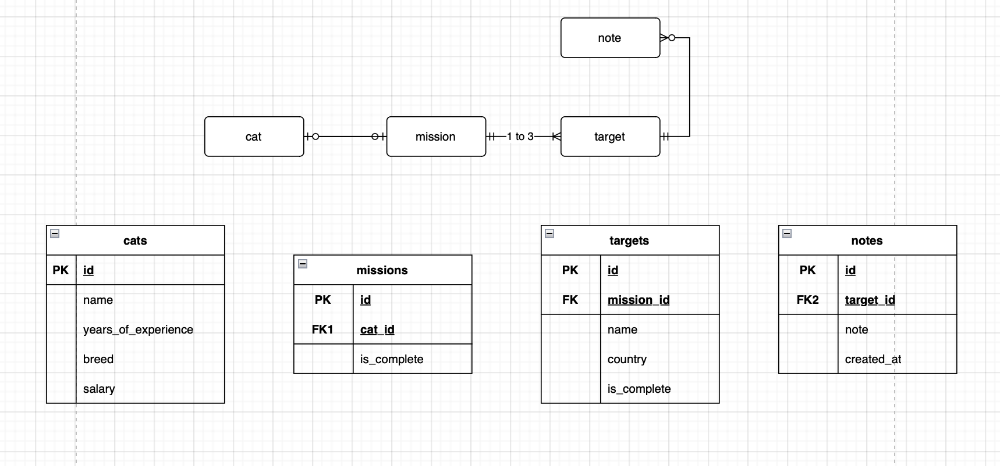

# Spy-Cat-Agency - Backend


## 🚀 Quick Start Guide  🚀


### Clone the Repository

Clone this repository and navigate to the project directory.
```
    git clone https://github.com/Mo1far-wiz/spy-cat-agency.git
    cd spy-cat-agency
```
### Run docker engine

Open docker Desctop.

## I have used golang-migrate

Guide to [install](https://github.com/golang-migrate/migrate/blob/master/cmd/migrate/README.md) 

### Start the Database & Apply Migrations

Run the following command to **start the database, apply migrations, and seed data**:
```
    make setup
```

### Run the Backend Server

Once the setup is complete, start the API server with:
```
    make run
```
The backend will start and listen on port `8080`.

### Stopping the Project

To stop running services just use:
```
    make down
```

### Postman Collection
A Postman collection is available in the `postman/` folder, ready to be used for testing the API. Simply import it into Postman and start testing the endpoints.

### Rough DB diagram

